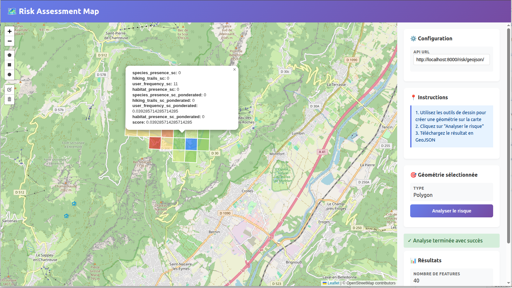

Ce projet propose un outil numérique permettant d’**identifier**, de **quantifier** et de **visualiser** le risque que représentent les activités outdoor sur les Espaces Naturels Sensibles (ENS).  
Il combine données de fréquentation, biodiversité, habitats et infrastructures (sentier) pour produire un **indicateur spatialisé de risque**. L'API peux être utilisable dans différents outils, notamment via **QGIS**, une **application web** et bien d'autres.

---

## 📌 Sommaire
- [Contexte](#-contexte)
- [Objectifs](#-objectifs)
- [Indicateur de risque](#-indicateur-de-risque)
  - [Scores de pression anthropique](#scores-de-pression-anthropique)
  - [Scores de patrimonialité](#scores-de-patrimonialité)
  - [Pondération](#pondération)
- [Outils](#-outils)
- [API](#-api)
- [Démonstrations](#-démonstrations)
- [Perspectives](#-perspectives)
- [Remerciements](#-remerciements)

---

## 🏞 Contexte

### 👥 Pour qui ?

Dans le cadre du Hackathon, le système est destiné aux gestionnaires d’ENS :
- 16 gestionnaires du CD38  
- 90 structures gestionnaires (communes, EPCI, PNR, associations)

### 📍 Où ?
Plus de 140 ENS sont concernés  
  - 17 départementaux  
  - 127 locaux  

La surface des ENS peuvent varier de **4 à 4 000 ha**


## 🎯 Objectifs

L'idée de VigieOutdoor est de permettre :

- L'intégration de secteurs vulnérables dans la **gestion écologique** des ENS  
- Réguler l’ouverture au public :
  - déviations d'itinéraires  
  - signalétique / mises en défens  
  - interdictions ciblées et temporaires  
  - instruction des manifestations sportives  
- Prioriser les **zones d’intervention**  
- Affiner la stratégie de communication et les programmes d’éducation à l’environnement  


## 🧮 Indicateur de risque

L’indicateur repose sur des **mailles de 500 × 500 m** (configurable sur des mailles plus fines) et combine **4 scores** pondérés.

### 🔵 Scores de pression anthropique

#### **1. Score de fréquentation**
- Nombre de sorties (année 2024)  
- **Source** [Outdoor Vision  ](https://outdoorvision.fr/)
- 24 532 traces analysées

#### **2. Score sentiers**
- Présence / absence et linéaire total des sentiers  
- Sources : [PDIPR](https://www.sportsdenature.gouv.fr/publications/outils-mobilisables-pour-perenniser-acces-lieux-de-pratique/pdipr),  [OpenStreeMap](https://www.openstreetmap.org/)  
- 17 954 sentiers recensés dans le cadre du hackathon sur le département de l'Isère


### 🟢 Scores de patrimonialité

#### **3. Score espèces patrimoniales**
- Somme des notes de patrimonialité des espèces observées  
- Sources : [CT88](http://ct88.espaces-naturels.fr/guide-delaboration-des-plans-de-gestion), [Conseil départemental de l'Isère](https://www.isere.fr/)  
- Dans le cadre du hackathon, seules 97 318 observations (1,2M au total)

#### **4. Score habitats patrimoniaux**
- Présence / absence et surface d’habitats d’intérêt  
- Sources : HIC, [APPHN](https://www.hauts-de-france.developpement-durable.gouv.fr/?Arretes-prefectoraux-de-protection-des-Habitats-Naturels-APPHN), [Liste Rouge régionale ](https://uicn.fr/listes-rouges-regionales/) 
- 11 640 habitats référencés ont été utilisés dans le cadre du hackathon


### ⚖️ Pondération

| **Facteur**                 | **Poids** |
|-------------------------|-------|
| Fréquentation           | 0.40  |
| Sentiers                | 0.10  |
| Habitats patrimoniaux   | 0.35  |
| Espèces patrimoniales   | 0.15  |

**Indicateur final** = *Fréquentation* x 0.40 + *Sentiers* x 0.10 + *Habitats patrimoniaux* x 0.35 + *Espèces patrimoniales* x 0.15


## 🛠 Outils

- **QGIS** (traitement spatial, calculs, cartographies)  
- **API & application web** pour l’affichage dynamique des résultats  


## 📡 Utilisation de l’API

### 🔧 Installation et lancement

Créer et activer un environnement virtuel, puis installer les dépendances :

```bash
python -m venv venv
source venv/bin/activate
pip install -r requirements.txt
```

Lancer ensuite l’API :

```bash
source venv/bin/activate
fastapi dev api.py
```


### 🔌 Endpoints disponibles

L’API expose deux routes principales :


#### **1. [GET] `/risk`**

Renvoie les mailles et leur indicateur de risque.
Cette route accepte une **bounding box**, fournie soit par :

* les quatre paramètres `x1`, `y1`, `x2`, `y2`,
* ou le paramètre unique `bbox` contenant les quatre valeurs.

**Exemples d’appel :**

```bash
curl -X GET "http://localhost:8000/risk?x1=5.540886&y1=45.280443&x2=5.564575&y2=45.26353"
```

ou

```bash
curl -X GET "http://localhost:8000/risk?bbox=5.540886,45.280443,5.564575,45.26353"
```

#### **2. [POST] `/risk/geojson`**

Renvoie les mailles et leur indicateur de risque à partir d’un **GeoJSON** fourni en entrée.

**Exemple d’appel :**

```bash
curl -X POST \
  -H "Content-Type: application/json" \
  -d @<votrefichier.geojson> \
  http://localhost:8000/risk/geojson
```


## 📸 Démonstrations

- Cartes sous QGIS  

- Interface web (disponible dans le fichier `index.html`)


## 🔭 Perspectives

### 🔧 Limites actuelles
- Pondération des facteurs améliorable  
- Choix des scores perfectibles

### 📈 Données futures à intégrer
- Inventaires Zones Humides  
- Pelouses sèches  
- Données supplémentaires de biodiversité et de pressions

### 🧪 Calibrage futur
- Comparaison avec :
  - cartes de pression existantes  
  - zones de quiétude définies


## 🙏 Remerciements

Merci aux gestionnaires, partenaires et contributeurs ayant participé aux jeux de données, aux analyses et à la conception de l’outil.


**Christophe Martinez**, Pôle Ressource National Transition Écologique et Sport Nature
**Thomas Mourey**, Département de l'Isère
**Ophélie Da Silva**, Natural Solutions
**Emilien Maulave**, Département de l'Isère
**Jacques Fize**, Parc National des Écrins
**Julien Vilmant**, INRAE
**Marion Drouin**, Decathlon
